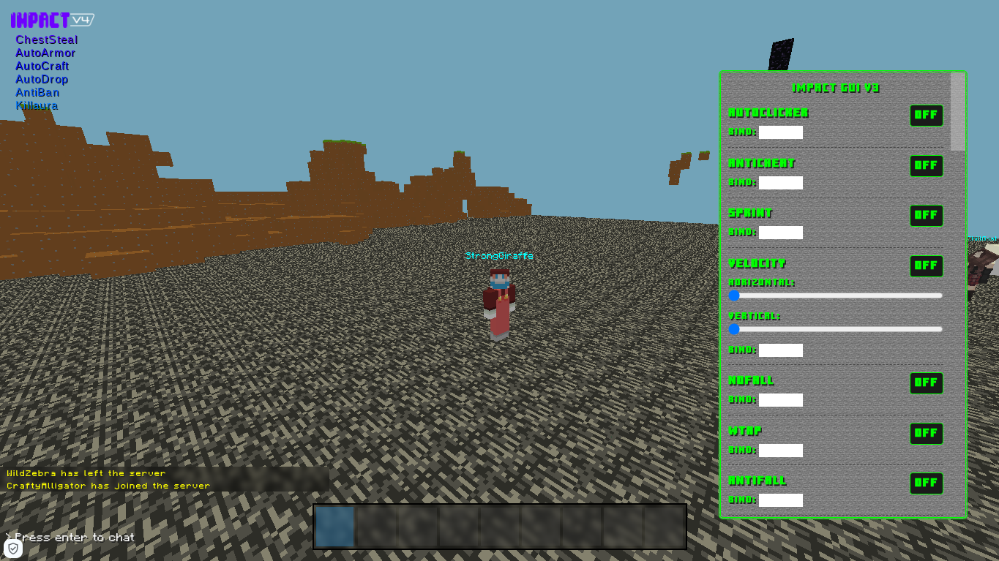

# 

# EULA

BEFORE USING, Read EULA.md

# Changelog

Re added fly, some of my testers still want it (including me)

.toggle all command (does not work, will be fixed soon)

Added better Scaffold bypass (module) by using a multi block scaffold (instead of just one inv space. It uses multiple inv slots from 1 - 9!)

Added better Click GUI with animations and themes with console.logs incase of an error. next i will add a localstorage save/load if possible. (and other cool css stuff)

Making Click GUI based off of LB (LiquidBounce) (shout out to devs of LB)

# Installation

Copy tampermonkey.user.js and paste into your preferred userscript manager. (Tampermonkey, Greasemonkey, Violentmonkey etc)

(M0duleMaster64's comment - Or use the main.js and manually put in the injection.js after the main)

## Join the Discord here

Join us on Discord! [here](https://discord.gg/PwpGemYhJx)!

# Notes to M0duleMaster64

(I re-added fly bc it can be still useful at times, and i think tokeniser.js is ready for use)

(M0duleMaster64's reply - alr)

# Gallery of Impact Client!

Hacks On! (OLD)

ON MENU with new toggled notfication that pops up

In Game!

Gonna add a video here showcasing this client!

**console.log("Coming soon...")**

# Dev Notes

- Info about index.html : Goto website.md file.

- **When updating the version of the script, remember to update VERSIONFILE, tampermonkey.js and injection.js**

- **DO NOT EVER PUBLISH UNSTABLE CHANGES TO THE "/" (ROOT) FOLDER. PUBLISH IT TO "beta" FOLDER INSTEAD PLS**

 ## Jobs to carry out (Here for now)

- Add a video showcasing the client with the new GUI interface (MM64's job whenever not MM64 is busy with Click GUI)
  
  ## Goals (May not be added)
  
- ForceOP Module (MM64 and ProgMEM's Job, forceop like means u can ban the owner in a server :D) (May not be added/ may not work)

- Nuker (I dont think this will work - MM64.)

- Force Creative / Inventory Modification (like thrax client - was made by 7GrandDad i think)

- Command Block modification (in survival mode. Again this could be possible - MM64)

- Working FLY / Airjump (this can be possible if RealPacket does the reset to the desync. this is also for nofall. see this https://codeberg.org/RealPacket/VapeForMiniblox/pulls/7

- Disabler for movement etc
